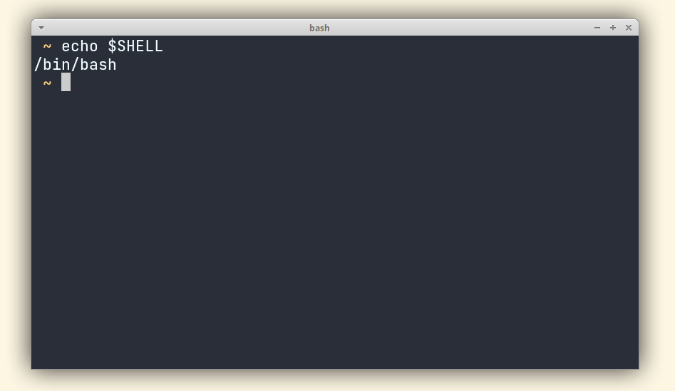

# My Terminal

# Kitty

```bash
sudo apt install kitty
sudo apt install fonts-jetbrains-mono
```
## Then...
```bash

#mkdir ~/.config/kitty/ 

Just put 'kitty.conf' on '~/.config/kitty/kitty.conf'

```
## OH MY BASH 

### Install
https://ohmybash.nntoan.com/

*Use the theme called 'minimal' (edit .bashrc, (OSH_THEME="minimal"))* 




